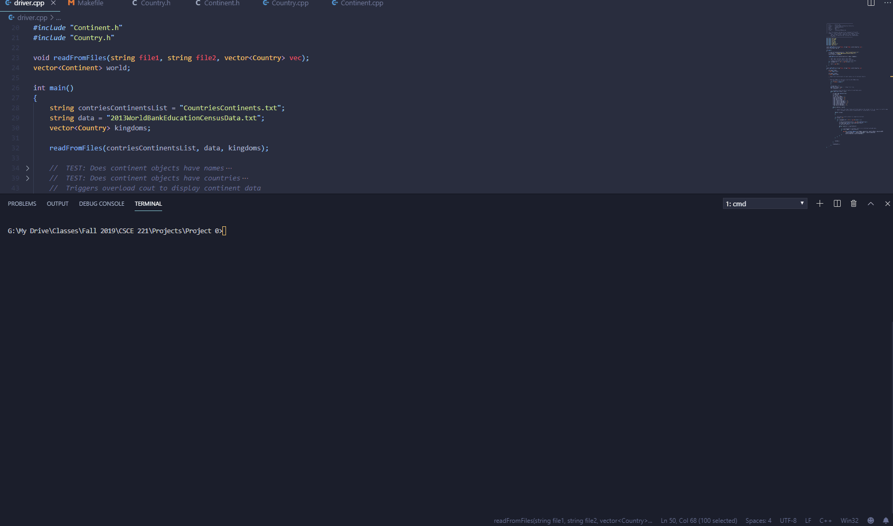

# World-Education-Statistics-Calculator
Beginner Data Structures and Algorithms project assigned in Texas A&amp;M University's CSCE 221 Class

See project-guidelines\ folder for more information on project

